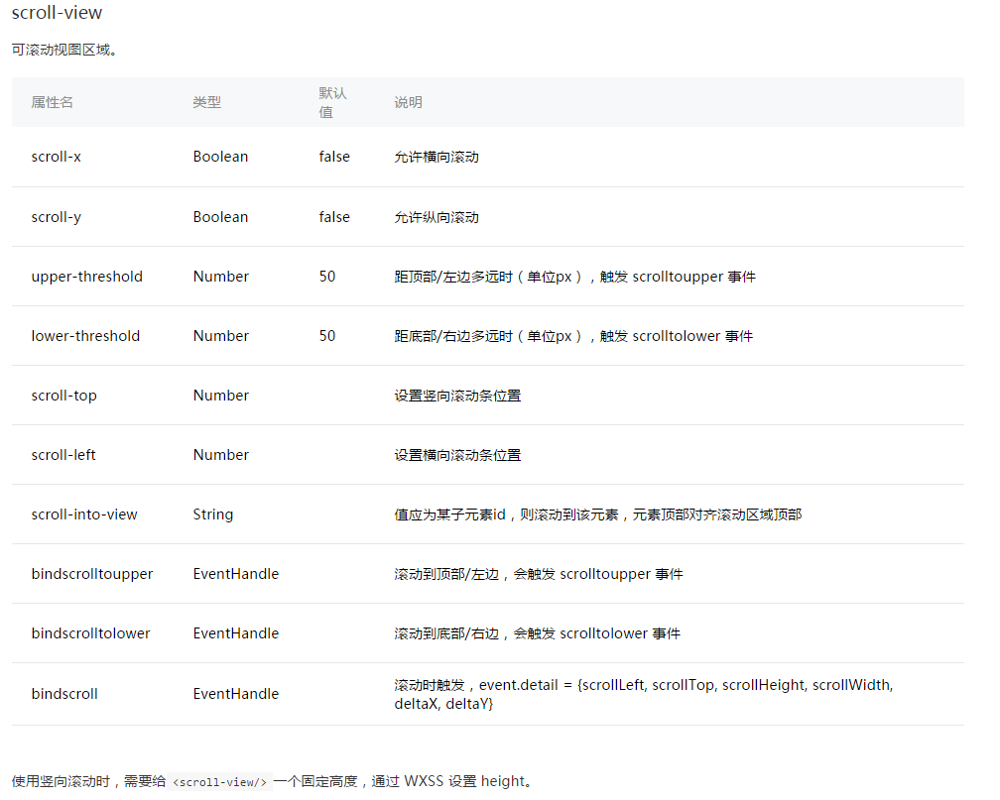

# 微信小程序 cnode社区版本

> 官方文档：https://mp.weixin.qq.com/debug/wxadoc/dev/

> 参考资料：https://github.com/coolfishstudio/wechat-webapp-cnode

>入门小例子: https://github.com/vincentSea/wxsapp

### 小程序预览


### 项目结构
<pre>
│  .gitattributes
│  .gitignore
│  app.js                # 小程序逻辑
│  app.json              # 小程序公共设置（页面路径、窗口表现、设置网络超时时间、设置多tab）
│  app.wxss              # 小程序公共样式表
│  README.md             # 小程序项目说明
│  
├─image                  # 小程序图片资源
|
├─pages                  # 小程序文件
│  ├─common     
│  ├─detail
│  ├─index        
│  │    index.js      # 页面逻辑
│  │    index.wxml    # 页面渲染层
│  │    index.wxss    # 页面样式
│  ├─login
|  ├─logs
│  └─topics
│          
└─utils                  # 小程序公用方法模块
    api.js       
    util.js    
</pre>


### 开发环境
下载地址 ：https://mp.weixin.qq.com/debug/wxadoc/dev/devtools/download.html?t=1474887501214

### 开发过程

1. 配置默认启动页面

  在app.json文件修改注册页面的顺序，把“pages/topics/topics” 放在第一位，就会自动把topics.wxml 显示默认启动

  <pre>
  {
  "pages":[
    "pages/topics/topics",      
    "pages/detail/detail",
    "pages/login/login",
    "pages/index/index",
    "pages/logs/logs"
  ]
  }
  </pre>

2. 配置tabBar

   tabBar 是一个数组，只能配置最少2个、最多5个 tab，tab 按数组的顺序排序。

  <pre>
  "tabBar":{
    "color":"#444",
    "selectedColor":"#80bd01",
    "backgroundColor":"#fff",
    "borderStyle":"white",
    "list":[{
      "pagePath":"pages/topics/topics",
      "text":"首页",
      "iconPath":"images/bar/CNode.png",
      "selectedIconPath":"images/bar/CNodeHL.png"
    },{
      "pagePath":"pages/index/index",
      "text":"我的",
      "iconPath":"images/bar/ME.png",
      "selectedIconPath":"images/bar/MEHL.png"
    }]
  }
  </pre>

3. window 设置

    具体看文档https://mp.weixin.qq.com/debug/wxadoc/dev/framework/config.html?t=1475052056717

4. 简单封装wx.request(OBJECT)


  <pre>
    // get请求方法
    function fetchGet(url, callback) {
      // return callback(null, top250)
      wx.request({
        url: url,
        header: { 'Content-Type': 'application/json' },
        success (res) {
          callback(null, res.data)
        },
        fail (e) {
          console.error(e)
          callback(e)
        }
      })
    }

    // post请求方法
    function fetchPost(url, data, callback) {
      wx.request({
        method: 'POST',
        url: url,
        data: data,
        success (res) {
          callback(null, res.data)
        },
        fail (e) {
          console.error(e)
          callback(e)
        }
      })
    }

    module.exports = {
      // METHOD
      fetchGet: fetchGet,
      fetchPost: fetchPost
    }
  </pre>


5. 滚动底部加载下一页

  使用了小程序自带的scroll-view组件

  

  ```bash
    <!--列表list组件 -->
    <template name="list">
      <scroll-view class="scroll-posts-list" style="height:100%" scroll-y="true" bindscrolltolower="lower">
        <view class="postslist">
          <block wx:for="{{postsList}}">
            <view class="posts-list">
              <navigator url="/pages/detail/detail?id={{item.id}}">
                <view class="posts-list-info" index="{{index}}">
                    <image class="userimg" src="{{item.author.avatar_url}}" />
                    <view class="item-box">
                      <view class="userinfo">
                        <text class="username">{{item.author.loginname}}</text>
                        <text class="time">{{item.last_reply_at}}</text>
                      </view>
                      <view class="posts-title">
                        <view class="posts-tag hot" wx:if="{{item.top === true}}">置顶</view>
                        <view class="posts-tag" wx:if="{{item.good === true}}">精华</view>
                        <text>{{item.title}}</text>
                      </view>
                    </view>
                </view>
                <view class="bar-info">
                  <view class="bar-info-item">
                    <image class="bar-info-item-icon" src="/images/icon/reply.png"></image>
                    <view class="bar-info-item-number">{{item.reply_count}}</view>
                  </view>
                  <view class="bar-info-item">
                    <image class="bar-info-item-icon" src="/images/icon/visit.png"></image>
                    <view class="bar-info-item-number">{{item.visit_count}}</view>
                  </view>

                  <view class="bar-info-item2"  wx:if="{{item.tab === 'good'}}">
                    <image class="bar-info-item-icon" src="/images/icon/type.png"></image>
                    <view class="bar-info-item-number">精华</view>
                  </view>
                  <view class="bar-info-item2"  wx:if="{{item.tab === 'share'}}">
                    <image class="bar-info-item-icon" src="/images/icon/type.png"></image>
                    <view class="bar-info-item-number">分享</view>
                  </view>
                  <view class="bar-info-item2"  wx:if="{{item.tab === 'ask'}}">
                    <image class="bar-info-item-icon" src="/images/icon/type.png"></image>
                    <view class="bar-info-item-number">问答</view>
                  </view>
                  <view class="bar-info-item2"  wx:if="{{item.tab === 'job'}}">
                    <image class="bar-info-item-icon" src="/images/icon/type.png"></image>
                    <view class="bar-info-item-number">招聘</view>
                  </view>
                </view>
            </navigator>
            </view>
          </block>
        </view>
      </scroll-view>

      <loading class="loading" hidden="{{hidden}}">
        <text class="loading-font">加载中...</text>
      </loading>
    </template>
  ```

  ```bash
    <!-- topics.wxml  -->
    <import src="../common/nav.wxml"/>
    <import src="../common/list.wxml"/>

    <view class="page topics">
      <template is="nav" data="{{ navList, activeIndex }}"/>
      <template is="list" data="{{ postsList, hidden }}"/>
    </view>
  ```

  滚动区的最大的父级层要设置height: 100%; 不然无法检测滚动事件
  也不知道是不是我布局的原因，我这里是一定要这样设置的
  ```bash
  .topics{
    height: 100%;
    overflow: hidden;
  }
  ```

  ```bash
  // 滑动底部加载
  lower: function() {
    console.log('滑动底部加载', new Date());
    var that = this;
    that.setData({
      page: that.data.page + 1
    });
    if (that.data.tab !== 'all') {
      this.getData({tab: that.data.tab, page: that.data.page});
    } else {
      this.getData({page: that.data.page});
    }
  }
  ```

  用法
  ```bash
    <scroll-view class="scroll-posts-list" style="height:100%" scroll-y="true" bindscrolltolower="lower">
    </scroll-view>
  ```


### 使用说明

1. 将仓库克隆到本地：

  ```bash
  $ git clone https://github.com/vincentSea/wechat-cnode.git
  ```

2. 打开`微信Web开放者工具`（注意：必须是`0.9.092300`版本）

3. 选择`添加项目`，填写或选择相应信息

  - AppID：点击右下角`无AppID`
  - 项目名称：随便填写，因为不涉及到部署，所以无所谓
  - 项目目录：选择刚刚克隆的文件夹
  - 点击`添加项目`


### 特别感谢
感谢 coolfish 的项目案例

coolfish的github: https://github.com/coolfishstudio
