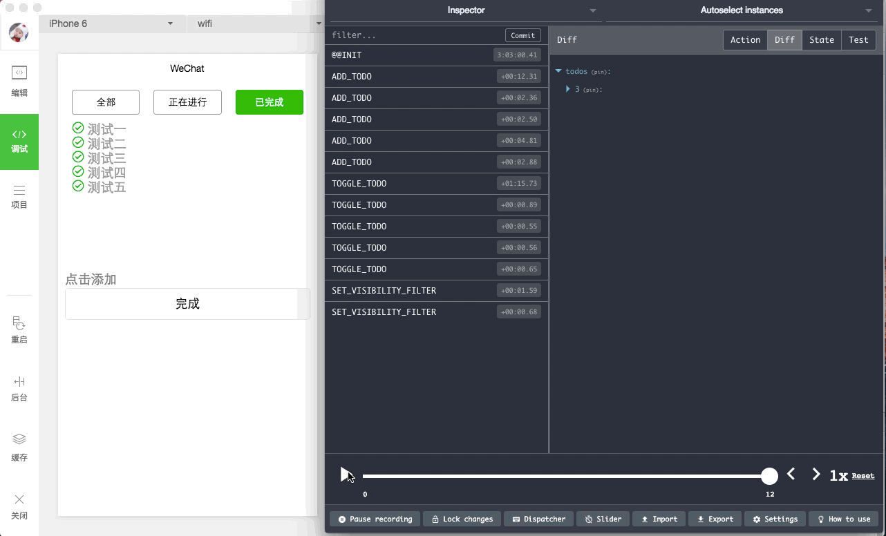

微信小程序集成Redux实现的Todo list
======================
在微信小程序中使用[Redux](https://github.com/reactjs/redux)实现Todo list，同时集成了redux-devtools



使用了我自己写的小程序的Redux绑定库：[wechat-weapp-redux](https://github.com/charleyw/wechat-weapp-redux)

### 使用

导入到微信的开发工具目录指向`src`运行就可以了。

### 开启redux-devtools

1. 把本项目根目录下的libs拷贝到`src/libs`中
2. 修改`src/configureStore`, 改成这样:
```
const {createStore, compose} = require('./libs/redux.js');
const devTools = require('./libs/remote-redux-devtools.js').default;
const reducer = require('./reducers/index.js')

// function configureStore() {
//   return createStore(reducer);
// }
function configureStore() {
  return createStore(reducer, compose(devTools({
    hostname: 'localhost',
    port: 5678,
    secure: false
  })));
}

module.exports = configureStore;
```

1. 本地安装remotedev-server并启动

   ```shell
   npm install -g remotedev-server
   remotedev --hostname=localhost --port=5678
   ```

2. 浏览器中访问**localhost:5678**
	如果不能访问，可以尝试使用**http://remotedev.io/local/**，打开后点击下面的setting，设置使用本地的server。

### Todos
* 集成redux-undo
* 集成redux-persist


## Liscense

© 2016 Wang Chao. This code is distributed under the MIT license.
