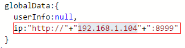
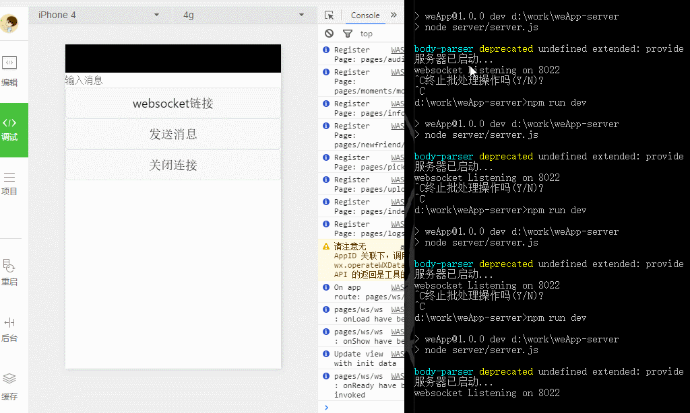

# WeApp - wechat
weApp for wechat by liujians [http://liujians.me](http://liujians.me)

###作者声明：
基于微信小程序开发的**仿微信demo**
 
整合了ionic的样式库和weui的样式库
 
**使用请查看使用必读!**
 
更新日志请点击[这里](./update.md)

目前功能

    查看消息
	网络请求获取数据（download示例server端demo）
    微信地图（调用API已换成map组件）
    发送图片
    查看朋友圈
    新的朋友
	实时文本搜索框（优化）
	IDE更新的下拉(目前跟一些组件会出现冲突，等待官方解决)
	2种播放器组件
	查看系统信息
	picker三种MODE
	upload与download接口的调用（示例server端demo一起更新）
	加入websocket示例，**需要重新install安装依赖**

等待官方加入新内容

 
欢迎一起学习交流

 
为学习微信小程序而开发，转发请附地址
> [https://github.com/liujians/WeApp](https://github.com/liujians/WeApp)

###使用必读：
- 10月08日之后的版本被我分离成了服务端和客户端2个demo
- 如果想要继续留有之前静态demo的请备份
 
- server 部分为单独一个项目，装载着此项目需要的数据，需要下载跑起来才能运行此项目
 
- 项目链接：
> [请点击这里下载示例server的demo](https://github.com/liujians/WeApp-server)

跑起服务器之后，在app.js中设置自己的Ip地址
 

###关于使用：
> 克隆本项目 -> 在微信开发工具中添加项目 -> 选择项目目录 -> 启动示例服务器 -> 重启项目

###项目展示：

###相关资源：
- [weapp-ide&weapp-api](https://mp.weixin.qq.com/debug/wxadoc/dev/devtools/download.html?t=1476197490095) - 微信小应用官方IDE和官方文档
- [WeApp-server](https://github.com/liujians/WeApp-server) - 项目的server示例服务器

