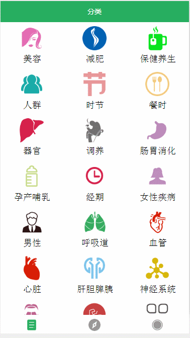

#### [Android版点这里](https://github.com/bestTao/caipu_android)
#### [React-Native版点这里](https://github.com/bestTao/caipu_react-native)
# 微信小程序--健康菜谱
基于微信小程序的一个查找检索菜谱的应用
### 功能
* 分类检索菜谱
* 发现最新菜谱
* 根据菜谱名搜索菜谱

### 用到的API
* 页面路由
* 列表渲染
* 带参数页面跳转
* navigator
* scrollview下拉加载更多
* ...

### 效果

### 待解决
动态改变标题栏的标题并不能生效，原因未知，具体代码中有注释
