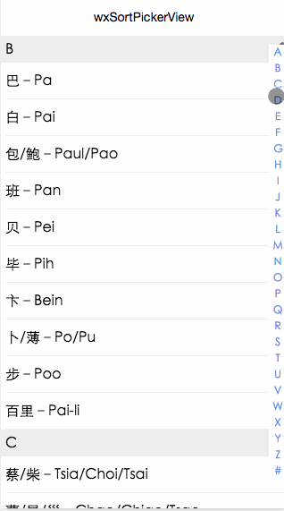

# wxSortPickerView
wxSortPickerView-微信小程序首字母排序选择表


## wxSortPickerView信息

* 版本号`0.1`
* github地址: [https://github.com/icindy/wxSortPickerView](https://github.com/icindy/wxSortPickerView)
* 解决问题:wxSortPickerView-微信小程序首字母排序选择表

##  开发信息

[微信小程序开发论坛](http://weappdev.com)
垂直微信小程序开发交流社区


## 特性

> 目前为版本0.1，功能单一，但可扩展场景比较多。相关场景会在0.2中加入

 + 字符串数组首字母排序
 + 左侧点击abc跳转
 + 点击item返回数据

## 扩展

 * 姓名排序选择
 * 地址排序选择
 
## 功能预览





## 使用方式

* 1.引入相关文件

* 2.初始化

```
var wxSortPickerView = require('../../wxSortPickerView/wxSortPickerView.js');
onLoad: function () {
    console.log('onLoad')
    var that = this
    //初始化
    wxSortPickerView.init(["艾–Ai","安–Ann/An","敖–Ao","巴–Pa","白–Pai","包/鲍–Paul/Pao","班–Pan","贝–Pei","毕–Pih","卞–Bein","卜/薄–Po/Pu","步–Poo","百里–Pai-li","蔡/柴–Tsia/Choi/Tsai","曹/晁/巢–Chao/Chiao/Tsao","岑–Cheng","崔–Tsui","查–Cha","常–Chiong","车–Che","陈–Chen/Chan/Tan","成/程–Cheng","池–Chi","褚/楚–Chu","淳于–Chwen-yu","戴/代–Day/Tai","邓–Teng/Tang/Tung","狄–Ti","刁–Tiao","丁–Ting/T","董/东–Tung/Tong","窦–Tou","杜–To/Du/Too","段–Tuan","端木–Duan-mu","东郭–Tung-kuo","东方–Tung-fang","范/樊–Fan/Van","房/方–Fang","费–Fei","冯/凤/封–Fung/Fong","符/傅–Fu/Foo","G:","盖–Kai","甘–Kan","高/郜–Gao/Kao","葛–Keh","耿–Keng","弓/宫/龚/恭–Kung","勾–Kou","古/谷/顾–Ku/Koo","桂–Kwei","管/关–Kuan/Kwan","郭/国–Kwok/Kuo","公孙–Kung-sun","公羊–Kung-yang","公冶–Kung-yeh","谷梁–Ku-liang","海–Hay","韩–Hon/Han","杭–Hang","郝–Hoa/Howe","何/贺–Ho","桓–Won","侯–Hou","洪–Hung","胡/扈–Hu/Hoo","花/华–Hua","宦–Huan","黄–Wong/Hwang","霍–Huo","皇甫–Hwang-fu","呼延–Hu-yen","I:","J:","纪/翼/季/吉/嵇/汲/籍/姬–Chi","居–Chu","贾–Chia","翦/简–Jen/Jane/Chieh","蒋/姜/江/–Chiang/Kwong","焦–Chiao","金/靳–Jin/King","景/荆–King/Ching","讦–Gan","K:","阚–Kan","康–Kang","柯–Kor/Ko","孔–Kong/Kung","寇–Ker","蒯–Kuai","匡–Kuang","L:","赖–Lai","蓝–Lan","郎–Long","劳–Lao","乐–Loh","雷–Rae/Ray/Lei","冷–Leng","黎/郦/利/李–Lee/Li/Lai/Li","连–Lien","廖–Liu/Liao","梁–Leung/Liang","林/蔺–Lim/Lin","凌–Lin","柳/刘–Liu/Lau","龙–Long","楼/娄–Lou","卢/路/陆鲁–Lu/Loo","伦–Lun","罗/骆–Loh/Lo/Law/Lam/Rowe","吕–Lui/Lu","令狐–Lin-hoo","M:","马/麻–Ma","麦–Mai/Mak","满–Man/Mai","毛–Mao","梅–Mei","孟/蒙–Mong/Meng","米/宓–Mi","苗/缪–Miau/Miao","闵–Min","穆/慕–Moo/Mo","莫–Mok/Mo","万俟–Moh-chi","慕容–Mo-yung","N:","倪–Nee","甯–Ning","聂–Nieh","牛–New/Niu","农–Long","南宫–Nan-kung","欧/区–Au/Ou","欧阳–Ou-yang","P:","潘–Pang/Pan","庞–Pang","裴–Pei/Bae","彭–Phang/Pong","皮–Pee","平–Ping","浦/蒲/卜–Poo/Pu","濮阳–Poo-yang","Q:","祁/戚/齐–Chi/Chyi/Chi/Chih","钱–Chien","乔–Chiao/Joe","秦–Ching","裘/仇/邱–Chiu","屈/曲/瞿–Chiu/Chu","R:","冉–Yien","饶–Yau","任–Jen/Yum","容/荣–Yung","阮–Yuen","芮–Nei","S:","司–Sze","桑–Sang","沙–Sa","邵–Shao","单/山–San","尚/商–Sang/Shang","沈/申–Shen","盛–Shen","史/施/师/石–Shih/Shi","苏/宿/舒–Sue/Se/Soo/Hsu","孙–Sun/Suen","宋–Song/Soung","司空–Sze-kung","司马–Sze-ma","司徒–Sze-to","单于–San-yu","上官–Sang-kuan","申屠–Shen-tu","T:","谈–Tan","汤/唐–Town/Towne/Tang","邰–Tai","谭–Tan/Tam","陶–Tao","藤–Teng","田–Tien","童–Tung","屠–Tu","澹台–Tan-tai","拓拔–Toh-bah","U:","V:","W:","万–Wan","王/汪–Wong","魏/卫/韦–Wei","温/文/闻–Wen/Chin/Vane/Man","翁–Ong","吴/伍/巫/武/邬/乌–Wu/NG/Woo","X:","奚/席–Hsi/Chi","夏–Har/Hsia/(Summer)","肖/萧–Shaw/Siu/Hsiao","项/向–Hsiang","解/谢–Tse/Shieh","辛–Hsing","刑–Hsing","熊–Hsiung/Hsiun","许/徐/荀–Shun/Hui/Hsu","宣–Hsuan","薛–Hsueh","西门–See-men","夏侯–Hsia-hou","轩辕–Hsuan-yuen","Y:","燕/晏/阎/严/颜–Yim/Yen","杨/羊/养–Young/Yang","姚–Yao/Yau","叶–Yip/Yeh/Yih","伊/易/羿–Yih/E","殷/阴/尹–Yi/Yin/Ying","应–Ying","尤/游–Yu/You","俞/庾/于/余/虞/郁/余/禹–Yue/Yu","袁/元–Yuan/Yuen","岳–Yue","云–Wing","尉迟–Yu-chi","宇文–Yu-wen","Z:","藏–Chang","曾/郑–Tsang/Cheng/Tseng","訾–Zi","宗–Chung","左/卓–Cho/Tso","翟–Chia","詹–Chan","甄–Chen","湛–Tsan","张/章–Cheung/Chang","赵/肇/招–Chao/Chiu/Chiao/Chioa","周/邹–Chau/Chou/Chow","钟–Chung","祖/竺/朱/诸/祝–Chu/Chuh","庄–Chong","钟离–Chung-li","诸葛–Chu-keh"],that);
  },

  //处理🉑接受点击返回的文字
  wxSortPickerViewItemTap: function(e){
    console.log(e.target.dataset.text);
  }
```


## 其他插件

* [wxParse-微信小程序富文本解析自定义组件，支持HTML及markdown解析](https://github.com/icindy/wxParse)
* [wxSearch-微信小程序优雅的搜索框](https://github.com/icindy/wxSearch)
* [WxNotificationCenter - 微信小程序通知广播模式类,降低小程序之间的耦合度](https://github.com/icindy/WxNotificationCenter)


##  开发信息

[微信小程序开发论坛](http://weappdev.com)
垂直微信小程序开发交流社区


## 捐助信息


